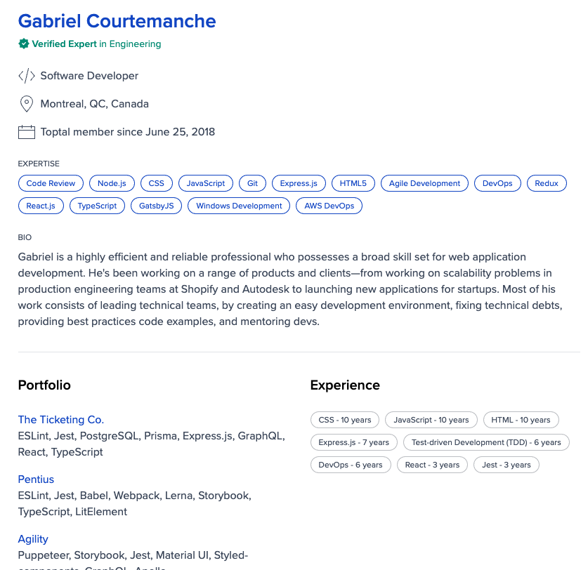

# Resume Builder

A modern, professional resume builder built with Next.js. Create stunning resumes in minutes with real-time preview and high-quality PDF export.



## ✨ Features

- 🎨 **Professional Templates** - Clean, modern resume designs
- 👀 **Real-time Preview** - See changes instantly as you type
- 📱 **Mobile Responsive** - Works perfectly on all devices
- 📄 **High-Quality PDF Export** - Server-side rendering with Puppeteer
- 💾 **JSON Import/Export** - Save and load resume data
- 🚀 **No Registration Required** - Start building immediately
- ⚡ **Fast Performance** - Built with Next.js and optimized for speed

## 🚀 Getting Started

### Prerequisites

- Node.js 18+ 
- pnpm (recommended) or npm

### Installation

1. Clone the repository:
```bash
git clone https://github.com/thienkq/resume-tool.git
cd resume-tool
```

2. Install dependencies:
```bash
pnpm install
```

3. Run the development server:
```bash
pnpm dev
```

4. Open [http://localhost:3000](http://localhost:3000) in your browser.

## 🔧 Commands

```bash
# Development
pnpm dev          # Start development server
pnpm build        # Build for production
pnpm start        # Start production server

# Linting & Formatting
pnpm lint         # Run ESLint
pnpm type-check   # Run TypeScript checks
```

## 🚀 Deploy to Vercel

1. Push your code to GitHub
2. Import your repository in [Vercel](https://vercel.com)
3. Update the domain in these files:
   - `app/layout.tsx` (metadataBase and OpenGraph URLs)
   - `app/sitemap.ts` (baseUrl)
   - `public/robots.txt` (sitemap URL)
4. Deploy!

The app is optimized for Vercel with:
- Serverless PDF generation using `@sparticuz/chromium`
- Optimized bundle sizes and performance
- SEO-friendly metadata and structured data

## 📱 PWA Support

The app includes a web manifest for Progressive Web App capabilities:
- Install as app on mobile devices
- Offline-ready structure
- App-like experience

## 🎯 SEO Optimized

- Complete meta tags and Open Graph data
- Structured data (JSON-LD) for search engines
- Sitemap and robots.txt
- Performance optimized for Core Web Vitals

## 🛠️ Tech Stack

- **Framework**: Next.js 15 (App Router)
- **Language**: TypeScript
- **Styling**: Tailwind CSS
- **UI Components**: Shadcn/ui (Radix UI)
- **PDF Generation**: Puppeteer + @sparticuz/chromium
- **Deployment**: Vercel

## 📁 Project Structure

```
resume-tool/
├── app/                    # Next.js app directory
│   ├── api/pdf/           # PDF generation API
│   ├── print/             # Browser print page
│   ├── print-pdf/         # Server PDF rendering page
│   └── layout.tsx         # Root layout with SEO
├── components/            # React components
│   ├── forms/            # Form components
│   ├── ui/               # UI components (shadcn)
│   └── ResumePreview.tsx # Main preview component
├── lib/                  # Utilities and types
├── public/               # Static assets
└── styles/               # Global styles
```

## 🤝 Contributing

1. Fork the repository
2. Create your feature branch (`git checkout -b feature/amazing-feature`)
3. Commit your changes (`git commit -m 'Add amazing feature'`)
4. Push to the branch (`git push origin feature/amazing-feature`)
5. Open a Pull Request

## 📄 License

This project is open source and available under the [MIT License](LICENSE).

## 🔗 Links

- [Live Demo](https://resume-builder.vercel.app) <!-- Update with your actual domain -->
- [GitHub Repository](https://github.com/thienkq/resume-tool)

---

Built with ❤️ using [Next.js](https://nextjs.org) and [Vercel](https://vercel.com)
